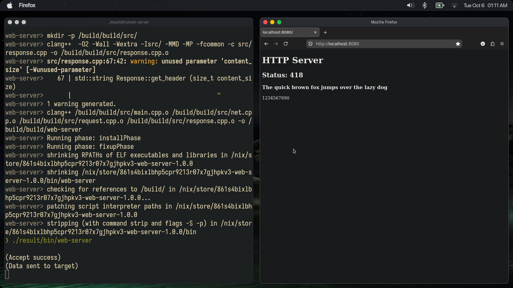

# An uncomplete HTTP server from scratch
- Using C++ and Linux/Posix network sockets.

## Build:
- Use `nix build --print-build-logs` if you want to use nix.
- Otherwise, install the dependencies and follow the commands in flake.nix.

## Todo:
- [x] Read a GET request from HTTP client
- [x] Send a GET response to a client
- [x] Improve on the previous two aims
- [x] Organise code
- [x] Allow for roughly declaring routes
- [ ] Improve/add on to the parser
- [ ] Optimise my code
- [ ] Add multithreading
- [ ] Consider security
- [ ] Add websocket support
- [ ] Support other request methods
